# CampusVerse — Phase 3A Web Authentication & Session Security Implementation

**Document Version:** 1.0.0
**Phase:** 3A — Secure Web Session Implementation (JWT Storage → HttpOnly Cookie)
**Date:** September 28, 2026
**Implementation Status:** **COMPLETE & VERIFIED**
**Target Repositories:**
- Web Frontend: [`CampusVerse-Website`](https://github.com/rohansiddhpura17-source/CampusVerse-Website) (`/Users/rohansiddhpura/Documents/campuswebsite`)
- Backend API: [`CampusVerse`](https://github.com/rohansiddhpura17-source/CampusVerse) (`/Users/rohansiddhpura/AndroidStudioProjects/CampusVerse/backend`)
- Mobile Client: [`CampusVerse Android App`](/Users/rohansiddhpura/AndroidStudioProjects/CampusVerse/app)

---

## 1. Executive Summary

Phase 3A eliminates the storage of JSON Web Tokens (JWT) in browser `localStorage` across the CampusVerse web application. The web frontend now authenticates exclusively through secure, browser-managed `HttpOnly` session cookies.

Browser JWT storage and browser-side Bearer authentication have been removed; the web session credential is now maintained in an HttpOnly cookie. Web login responses do not expose the JWT. Native/legacy clients continue receiving JWTs for backward compatibility.

Simultaneously, **100% backward compatibility** is preserved for non-browser clients:
- The backend continues to return the JWT in the JSON response body (`data.token`) for non-web / legacy clients.
- For web clients (`X-CampusVerse-Client: web`), the JWT is omitted from the JSON payload to prevent client-side JavaScript access.
- The backend authentication middleware accepts either an incoming `HttpOnly` session cookie or an `Authorization: Bearer <token>` header.
- The Android mobile application, CLI tools, and automated backend test suites continue functioning without modification.
- Authoritative Role-Based Access Control (RBAC) remains strictly enforced on the server.

> [!IMPORTANT]
> **Authoritative Security Boundary Principle:**
> Server-side Express middleware (`auth.middleware.ts` and `rbac.middleware.ts`) enforcing cryptographic JWT signature verification and database-backed permission validation remains the **sole authoritative security boundary**. Frontend React state, route guards, and cookie transport are defense-in-depth and client navigation controls only.

---

## 2. Comparison: Previous vs New Architecture

```mermaid
flowchart TD
    subgraph Old ["Previous Architecture (Vulnerable to XSS Exfiltration)"]
        BrowserOld["Web Browser"]
        StorageOld["localStorage ('campusverse_token')<br/>⚠️ Readable by any JavaScript"]
        AxiosOld["Axios Request Interceptor"]
        BackendOld["Express Backend<br/>(Bearer header only)"]

        BrowserOld -->|Login/Register| BackendOld
        BackendOld -->|Returns token in JSON| BrowserOld
        BrowserOld -->|Stores token| StorageOld
        StorageOld -->|Reads token| AxiosOld
        AxiosOld -->|Authorization: Bearer <token>| BackendOld
    end

    subgraph New ["New Architecture (Phase 3A - Secure HttpOnly Session)"]
        BrowserNew["Web Browser<br/>(user state in memory only)"]
        CookieJar["Browser Secure Cookie Jar<br/>(__Host-campusverse_session)<br/>🛡️ HttpOnly (Inaccessible to JS)"]
        AxiosNew["Axios Client (withCredentials: true)<br/>X-CampusVerse-Client: web"]
        BackendNew["Express Backend<br/>(Dual Auth + CSRF Guard)"]
        AndroidClient["Android Mobile Client<br/>(Authorization: Bearer)"]

        BrowserNew -->|Login/Register| BackendNew
        BackendNew -->|Set-Cookie: __Host-campusverse_session<br/>+ JSON token for Android| BrowserNew
        BrowserNew -->|Cookie stored automatically| CookieJar
        CookieJar -.->|Auto-attached on API calls| AxiosNew
        AxiosNew -->|Credentialed Request| BackendNew
        AndroidClient -->|Authorization: Bearer <token>| BackendNew
    end
```



---

## 3. Session Cookie Configuration

The session cookie is configured in [`backend/src/config/cookie.ts`](file:///Users/rohansiddhpura/AndroidStudioProjects/CampusVerse/backend/src/config/cookie.ts):

| Attribute | Production Value | Development Value | Technical Rationale |
| :--- | :---: | :---: | :--- |
| **Cookie Name** | `__Host-campusverse_session` | `campusverse_session` | In production, `__Host-` prefix enforces RFC 6265bis requirements (must be `Secure`, `Path=/`, and host-only). In development, standard name prevents browser rejection over plain HTTP on localhost. |
| **`HttpOnly`** | `true` | `true` | Prevents client-side scripts, XSS payloads, or third-party dependencies from accessing credentials via `document.cookie`. |
| **`Secure`** | `true` | `false` | Mandates that the browser transmits the cookie exclusively over encrypted HTTPS connections in production. |
| **`SameSite`** | `'none'` | `'lax'` | **Explicit Architectural Requirement:** The current Render deployment requires `SameSite=None` because the web client (`campusverse-website.onrender.com`) and API (`campusverse-api-k5ny.onrender.com`) are cross-site under the Public Suffix List. `SameSite=Strict` and `SameSite=Lax` cookies are withheld by browsers on cross-site subresource requests. |
| **`Path`** | `/` | `/` | Scopes cookie across all application routes. |
| **`Max-Age`** | 7 days (`604800000` ms) | 7 days | Matches the backend `JWT_EXPIRES_IN=7d` token expiration. |
| **`Domain`** | *Omitted* | *Omitted* | **Host-only cookie:** The `Domain` property is intentionally omitted. Specifying `Domain=.onrender.com` is forbidden by user agents because `onrender.com` is on the Public Suffix List. |

---

## 4. Cross-Site Request Forgery (CSRF) Defense Model

Because `SameSite=None` permits browsers to attach cookies across cross-site contexts, a dedicated CSRF mitigation middleware is implemented in [`backend/src/middleware/csrf.middleware.ts`](file:///Users/rohansiddhpura/AndroidStudioProjects/CampusVerse/backend/src/middleware/csrf.middleware.ts):

1. **Safe Methods Exemption:**
   `GET`, `HEAD`, and `OPTIONS` requests are read-only and are never blocked.
2. **Bearer Token Client Exemption:**
   Native clients (Android app, CLI tools, server-to-server calls) authenticate via `Authorization: Bearer <token>`. Because Bearer headers are not ambient browser credentials and cannot be forged by standard HTML forms, they are exempted from origin validation.
3. **Strict Origin & Referer Validation:**
   For all state-changing requests (`POST`, `PUT`, `PATCH`, `DELETE`) authenticated via cookie, the backend validates that `req.headers.origin` (or `req.headers.referer`) matches the trusted web application:
    - Production: `https://campusverse-website.onrender.com` (and custom domains if declared via `CORS_ORIGIN`).
    - Development / Test: `localhost` and `127.0.0.1` ports.
    - Any request with an untrusted or missing Origin is rejected with **HTTP 403 `CSRF_FORBIDDEN`**.
4. **Defense-in-Depth Client Header:**
    The frontend Axios client attaches `X-CampusVerse-Client: web` on every outgoing request. Standard HTML forms cannot send custom headers without triggering a preflight request. *(Note: This header serves as secondary defense-in-depth; strict Origin verification provides the authoritative CSRF boundary).*

---

## 5. Cross-Origin Resource Sharing (CORS) Configuration

In [`backend/src/app.ts`](file:///Users/rohansiddhpura/AndroidStudioProjects/CampusVerse/backend/src/app.ts):
- **Allowed Origins:** Explicit list containing active production origin `https://campusverse-website.onrender.com`, and dynamic entries from `env.CORS_ORIGIN`. Unconfigured domains are excluded from active defaults. Wildcards (`*`) are disallowed.
- **Credentials:** `credentials: true` is enabled, permitting browsers to expose response headers and transmit credentialed cookies.
- **Local Development:** Regular expression matching `localhost`, `127.0.0.1`, and Android emulator host `10.0.2.2` is enabled when `NODE_ENV !== 'production'`.

---

## 6. Android Mobile Client Backward Compatibility

The native Android mobile application operates without any modifications:
1. **Response Contract Intact:** `POST /auth/login` and `POST /auth/register` continue returning `{ success: true, data: { token, user } }`.
2. **Dual-Credential Middleware:** `auth.middleware.ts` inspects incoming requests in this exact order:
   - `a. req.cookies?.__Host-campusverse_session || req.cookies?.campusverse_session`
   - `b. req.headers.authorization` (`Bearer <token>`)
3. **Android Invocations:** Android `HttpURLConnection` requests attach `Authorization: Bearer $token` and are seamlessly validated by fallback branch `(b)`.
4. **Zero Regressions:** 11/11 tests in `tests/auth.test.ts` pass verifying that Bearer token requests remain 100% functional.

---

## 7. Inventory of Files Changed

### Backend (`/Users/rohansiddhpura/AndroidStudioProjects/CampusVerse/backend`)
1. [`package.json`](file:///Users/rohansiddhpura/AndroidStudioProjects/CampusVerse/backend/package.json): Added `"cookie-parser": "^1.4.7"` and `"@types/cookie-parser": "^1.4.8"`.
2. [`src/config/cookie.ts`](file:///Users/rohansiddhpura/AndroidStudioProjects/CampusVerse/backend/src/config/cookie.ts) *(New)*: Cookie configuration constants, host-only attribute builder, and `setSessionCookie` / `clearSessionCookie` helpers.
3. [`src/middleware/cookie.middleware.ts`](file:///Users/rohansiddhpura/AndroidStudioProjects/CampusVerse/backend/src/middleware/cookie.middleware.ts) *(New)*: Zero-dependency Express cookie parser middleware.
4. [`src/middleware/csrf.middleware.ts`](file:///Users/rohansiddhpura/AndroidStudioProjects/CampusVerse/backend/src/middleware/csrf.middleware.ts) *(New)*: CSRF Origin validation for cookie-authenticated mutations.
5. [`src/types/express.d.ts`](file:///Users/rohansiddhpura/AndroidStudioProjects/CampusVerse/backend/src/types/express.d.ts): Added `authMethod?: 'cookie' | 'bearer'` and `cookies?: Record<string, string>` to Express Request.
6. [`src/app.ts`](file:///Users/rohansiddhpura/AndroidStudioProjects/CampusVerse/backend/src/app.ts): Mounted `cookieParserMiddleware` and set active `productionOrigins` strictly to `https://campusverse-website.onrender.com`.
7. [`src/middleware/auth.middleware.ts`](file:///Users/rohansiddhpura/AndroidStudioProjects/CampusVerse/backend/src/middleware/auth.middleware.ts): Implemented dual-credential extraction (in production authenticates from ONLY `__Host-campusverse_session` and rejects `campusverse_session`; in development accepts `campusverse_session`; preserves Bearer fallback for Android), CSRF origin check, and attached `req.authMethod`.
8. [`src/controllers/auth.controller.ts`](file:///Users/rohansiddhpura/AndroidStudioProjects/CampusVerse/backend/src/controllers/auth.controller.ts): Called `setSessionCookie` and omitted token for web (`X-CampusVerse-Client: web`), while preserving token in JSON for Android / legacy clients; called `clearSessionCookie` on `logout`.
9. [`tests/cookie_session_csrf.test.ts`](file:///Users/rohansiddhpura/AndroidStudioProjects/CampusVerse/backend/tests/cookie_session_csrf.test.ts) *(New)*: 21 automated test cases verifying cookie emission (omitting token for web, retaining token for Android/legacy), production vs development cookie-name enforcement, cookie authentication, Bearer compatibility, production vs development cookie attributes, exact-origin CSRF rejection, and cookie clearing.

### Frontend (`/Users/rohansiddhpura/Documents/campuswebsite`)
1. [`lib/api/client.ts`](file:///Users/rohansiddhpura/Documents/campuswebsite/lib/api/client.ts): Enabled `withCredentials: true`, attached `X-CampusVerse-Client: web` header, removed `localStorage.getItem('campusverse_token')`, and removed `localStorage.removeItem` from 401 interceptor.
2. [`lib/context/auth-context.tsx`](file:///Users/rohansiddhpura/Documents/campuswebsite/lib/context/auth-context.tsx): Removed `token` state, eliminated all `localStorage` reads/writes, and updated `refreshSession()` to call `GET /auth/me` on mount relying on the browser cookie.
3. [`lib/api/auth.ts`](file:///Users/rohansiddhpura/Documents/campuswebsite/lib/api/auth.ts): Made `token?: string` optional in `AuthResponse` and removed `localStorage.removeItem` from `logout()`.

---

## 8. Verification & Test Results

### Backend Automated Test Suites
```bash
npm test tests/auth.test.ts tests/cookie_session_csrf.test.ts
```
**Result: PASS (2/2 suites passed, 32/32 tests passed)**
- `tests/cookie_session_csrf.test.ts` (21/21 passed):
  - `✓ B: POST /auth/register with X-CampusVerse-Client: web sets HttpOnly cookie and OMITS token in JSON`
  - `✓ A: POST /auth/login with X-CampusVerse-Client: web sets HttpOnly cookie and OMITS token in JSON`
  - `✓ D: POST /auth/register without web header returns JWT token in JSON for Android / legacy clients`
  - `✓ C: POST /auth/login without web header returns JWT token in JSON for Android / legacy clients`
  - `✓ GET /auth/me succeeds with cookie authentication without Bearer header`
  - `✓ GET /auth/me succeeds with Authorization: Bearer token without cookie (Android)`
  - `✓ GET /auth/me returns 401 when both cookie and Bearer token are absent`
  - `✓ Production mode: accepts ONLY __Host-campusverse_session and rejects campusverse_session`
  - `✓ Development mode: accepts campusverse_session`
  - `✓ Production cookie options enforce __Host- prefix, HttpOnly, Secure, SameSite=None, Path=/, and NO Domain`
  - `✓ Development cookie options enforce campusverse_session, HttpOnly, Secure=false, SameSite=Lax, Path=/, and NO Domain`
  - `✓ Unit: isTrustedWebOrigin rejects prefix attacker origin https://campusverse-website.onrender.com.attacker.com`
  - `✓ Unit: isTrustedWebOrigin rejects query-string attacker origin https://attacker.com/?origin=https://campusverse-website.onrender.com`
  - `✓ Unit: isTrustedWebOrigin approves exact trusted production origin https://campusverse-website.onrender.com`
  - `✓ Integration: Origin https://campusverse-website.onrender.com.attacker.com returns 403 CSRF_FORBIDDEN`
  - `✓ Integration: Origin https://attacker.com/?origin=https://campusverse-website.onrender.com returns 403 CSRF_FORBIDDEN`
  - `✓ Integration: Missing Origin and Referer returns 403 CSRF_FORBIDDEN`
  - `✓ Integration: Trusted exact origin https://campusverse-website.onrender.com returns 200 OK`
  - `✓ Android Bearer mutation without Origin header succeeds (exempted from CSRF)`
  - `✓ Safe methods (GET) with cookie are unaffected by Origin header`
  - `✓ Protected admin route rejects student cookie session with 401 or 403`
- `tests/auth.test.ts` (11/11 passed):
  - All 11 baseline authentication, password validation, and zero-self-granting tests passed.

### Frontend Static Typecheck
```bash
npm run typecheck (tsc --noEmit)
```
**Result: PASS (0 errors, Exit code: 0)**

### Zero `localStorage` Token Verification
A source search across the entire web application (`app/`, `components/`, `hooks/`, `lib/`) confirmed:
- `campusverse_token`: **0 occurrences**
- `localStorage`: **0 occurrences**
- `Authorization`: **0 occurrences**
- `Bearer`: **0 occurrences**

### Build Environment Verification
The local production build could not be fully completed because the known Node.js v24 / macOS Sequoia arm64 Next.js jest-worker environment issue causes the build to hang. Typecheck, authentication integration tests, cookie/CSRF tests, configuration validation, and backend TypeScript verification passed.

---

## 9. Future Custom-Domain Migration (`campusverse.edu`)

When production custom domains are activated:
1. **Topology:**
   - Web: `https://campusverse.edu` (or `https://app.campusverse.edu`)
   - API: `https://api.campusverse.edu`
2. **Cookie Evolution:**
   - Both hostnames belong to the same private registrable domain (`campusverse.edu`).
   - The cookie policy can transition from `SameSite=None` to `SameSite=Lax`.
   - **Recommendation:** Prefer a **host-only API cookie** rather than `Domain=.campusverse.edu` unless a concrete cross-subdomain sharing requirement is proven. A host-only cookie on `api.campusverse.edu` contacted via CORS from `campusverse.edu` is more secure against subdomain takeover.

---

## 10. Rollback Procedure

If cross-site cookie rejection occurs in legacy browsers:
1. Reverting `lib/api/client.ts` to attach `Authorization: Bearer <token>` immediately restores the baseline behavior.
2. Because `auth.middleware.ts` maintains the Bearer-token resolution branch, zero backend redeployments or database schema migrations are required to rollback.
