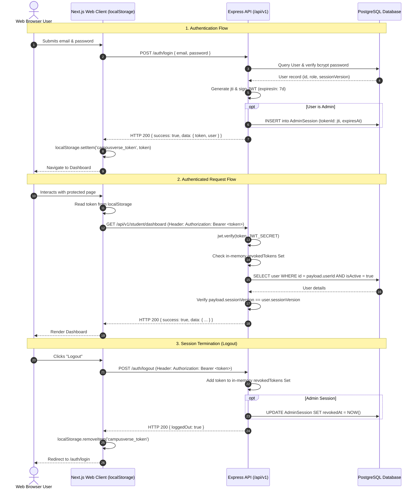
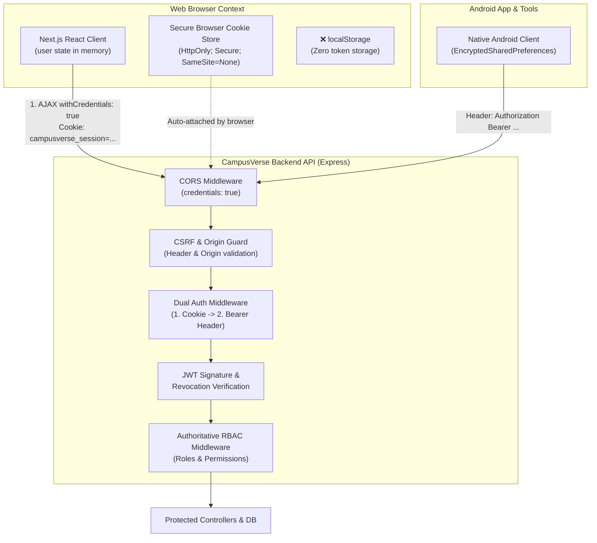

# CampusVerse — Phase 3 Authentication & Session Security Audit & Design

**Document Version:** 1.0.0
**Phase:** 3 — Authentication & Session Security: JWT Storage → Secure HttpOnly Session
**Date:** September 28, 2026
**Auditor / Architect:** Principal Infrastructure & Security Architect
**Repositories:**
- Frontend: [`CampusVerse-Website`](https://github.com/rohansiddhpura17-source/CampusVerse-Website) (`/Users/rohansiddhpura/Documents/campuswebsite`)
- Backend: [`CampusVerse`](https://github.com/rohansiddhpura17-source/CampusVerse) (`/Users/rohansiddhpura/AndroidStudioProjects/CampusVerse/backend`)
- Android Client: [`CampusVerse Android App`](/Users/rohansiddhpura/AndroidStudioProjects/CampusVerse/app)

---

## Executive Summary

This audit assesses the current authentication and session architecture across the CampusVerse web frontend, backend Express API, and Android mobile client. The primary objective is to formulate a migration strategy away from storing JSON Web Tokens (JWT) in browser `localStorage` towards secure, `HttpOnly` session cookies, while strictly preserving backward compatibility for the Android mobile application, non-browser clients, automated test suites, and maintaining authoritative backend Role-Based Access Control (RBAC).

> [!IMPORTANT]
> **Authoritative Security Boundary Principle:**
> The backend Express middleware (`auth.middleware.ts` and `rbac.middleware.ts`) enforcing cryptographic token verification and database-backed permission validation is the **sole authoritative security boundary**. Frontend React state, route guards (`components/guards/route-guards.tsx`), and browser storage are client-side navigation aids and defense-in-depth mechanisms only.

---

## A. Current Authentication Architecture

### 1. Architectural Overview
The CampusVerse ecosystem currently employs a stateless JWT bearer token architecture:
1. **Frontend Web Client:** A Next.js 14 App Router application deployed on Render (`https://campusverse-website.onrender.com`).
2. **Backend API:** An Express / TypeScript / Prisma application deployed on Render (`https://campusverse-api-k5ny.onrender.com`).
3. **Mobile Client:** A native Android application communicating over HTTPS via `HttpURLConnection`.
4. **Database:** PostgreSQL hosted on Supabase (`aws-0-ap-south-1.pooler.supabase.com:6543`), accessed via Prisma ORM.

### 2. Detailed Component Audit

#### Frontend Web Client
- **`lib/api/client.ts`:**
  - Instantiates an Axios client (`apiClient`) with `baseURL: process.env.NEXT_PUBLIC_API_URL || 'http://localhost:4000/api/v1'`.
  - **Request Interceptor (lines 15–26):** Inspects `typeof window !== 'undefined'` and retrieves `localStorage.getItem('campusverse_token')`. If present, sets `config.headers.Authorization = 'Bearer ' + token`.
  - **Response Interceptor (lines 28–54):** Unwraps the standard response envelope (`response.data.data`). On HTTP 401, if the current path does not start with `/auth/`, executes `localStorage.removeItem('campusverse_token')` and forces redirection to `/auth/login?redirect=...`.
  - **Noticeable Absence:** `withCredentials: true` is **not configured** on the Axios client.
- **`lib/context/auth-context.tsx`:**
  - Manages React state: `user: User | null`, `token: string | null`, and `status: 'loading' | 'authenticated' | 'unauthenticated'`.
  - **Session Restoration (`refreshSession`, lines 26–47):** On mount, reads `localStorage.getItem('campusverse_token')`. If missing, sets status to `unauthenticated`. If found, calls `authApi.getMe()`. If successful, sets user; if rejected, executes `localStorage.removeItem('campusverse_token')`.
  - **Login / Register (lines 53–81):** Receives `{ token, user }` from `authApi.login()` / `authApi.register()`. Calls `localStorage.setItem('campusverse_token', response.token)`.
  - **Logout (lines 83–93):** Calls `authApi.logout()`, then in a `finally` block executes `localStorage.removeItem('campusverse_token')` and resets React state.
- **`lib/api/auth.ts`:**
  - Encapsulates authentication endpoints: `POST /auth/register`, `POST /auth/login`, `GET /auth/me`, `POST /auth/logout`, `POST /auth/send-otp`, `POST /auth/verify-otp`, `POST /auth/forgot-password`, `POST /auth/reset-password`.
- **`components/guards/route-guards.tsx`:**
  - Provides `AuthenticatedRoute`, `PublicRoute`, and role-based guards (`StudentRoute`, `AlumniRoute`, `AdminRoute`, `AspirantRoute`).
  - Evaluates `useAuth()` status and user permissions. Does not interact directly with `localStorage`.

#### Backend API
- **`src/routes/auth.routes.ts`:**
  - Registers `/register` (public), `/login` (public), `/logout` (`requireAuth`), `/refresh` (`requireAuth`), `/me` (`requireAuth`), and OTP endpoints.
- **`src/controllers/auth.controller.ts`:**
  - **`register` (lines 55–140):** Creates user in database, signs a JWT via `signToken()`, and returns `{ success: true, data: { token, user } }` with HTTP 201.
  - **`login` (lines 142–244):** Verifies email and bcrypt password hash. Evaluates RBAC permissions. Generates UUID `jti`. Signs JWT with 7-day expiration. If user has administrative roles, creates an `AdminSession` record in database and logs audit event. Returns `{ success: true, data: { token, user } }` with HTTP 200.
  - **`logout` (lines 246–269):** Extracts raw token from `req.token` or `Authorization` header. Adds token to an in-memory `revokedTokens` Set. If `jti` exists, sets `AdminSession.revokedAt = new Date()`.
  - **`refreshToken` (lines 271–310):** Requires active authenticated session. Generates a new `jti` and signs a new 7-day token.
  - **`getCurrentUser` (`/me`):** Returns profile, roles, and permissions of `req.user`.
- **`src/middleware/auth.middleware.ts`:**
  - Extracts `req.headers.authorization`.
  - Validates `Bearer <token>` format. Returns 401 `UNAUTHORIZED` if missing.
  - Verifies token signature and expiration via `jwt.verify(token, env.JWT_SECRET)`. Returns 401 `INVALID_TOKEN` on failure.
  - Checks in-memory `isTokenRevoked(token)`. Returns 401 `SESSION_REVOKED` if found.
  - Verifies active status in database and compares `payload.sessionVersion !== user.sessionVersion`.
  - If `jti` exists, checks `AdminSession.revokedAt` and expiration.
  - Attaches `req.user`, `req.token`, `req.jti` to Express Request.
- **`src/app.ts`:**
  - Configures strict CORS middleware:
    - `origin`: Validates against allowed origins (`https://campusverse.edu`, `https://www.campusverse.edu`, and custom origins from `CORS_ORIGIN`). Allows null origins (mobile, curl).
    - `credentials: true`: **Already enabled.**
  - **Noticeable Absence:** Express does **not** mount `cookie-parser` middleware.

#### Android Mobile Client
- **`NetworkAuthRepository.kt` & `NetworkAdminRepository.kt`:**
  - Issues HTTP requests via native `HttpURLConnection`.
  - Stores token natively in Android EncryptedSharedPreferences / secure storage.
  - Explicitly injects `conn.setRequestProperty("Authorization", "Bearer " + token)` on every authenticated request.
  - Expects `{ success: true, data: { token, user } }` response format.

---

## B. Current Token Lifecycle



---

## C. Current Security Risks & Vulnerabilities

| Risk Category | Current Implementation | Severity | Technical Vulnerability & Attack Surface |
| :--- | :--- | :---: | :--- |
| **Storage Medium** | Browser `localStorage` (`campusverse_token`) | **HIGH** | `localStorage` has no access restrictions against JavaScript executing in the same origin. Any Cross-Site Scripting (XSS) vulnerability, malicious npm third-party dependency, or compromised script tag can execute `localStorage.getItem('campusverse_token')` and instantly exfiltrate credentials. |
| **Token Lifetime** | 7 days (`JWT_EXPIRES_IN=7d`) | **MEDIUM-HIGH** | A 7-day bearer token acts as an indefinitely reusable credential. If intercepted via client compromise or network proxy, an attacker possesses a 168-hour window of unrestricted access. |
| **Revocation Persistence** | In-memory `Set<string>` in `jwt.ts` | **HIGH** | The `revokedTokens` blacklist exists solely in volatile process RAM. Upon server restart, deployment rollout, or horizontal scaling across multiple Render instances, the blacklist is wiped, reviving previously logged-out tokens. |
| **Refresh Token Architecture** | Absent (`/auth/refresh` re-signs active token) | **MEDIUM** | No cryptographic separation exists between a short-lived access token and a long-lived, rotatable refresh token. Re-authentication requires the active access token itself. |
| **Concurrent Session Tracking** | Only `AdminSession` exists in database | **MEDIUM** | Standard students, aspirants, and alumni have no database session records (`UserSession`). A user cannot view active login sessions, inspect devices, or selectively terminate a single compromised mobile/web session without incrementing `sessionVersion` (which invalidates all sessions). |
| **Transport Binding** | Bearer header without client binding | **MEDIUM** | The token is not cryptographically or network-bound to client attributes; any bearer can present the token from any IP or device until expiration. |

---

## D. Cookie Migration Feasibility & Deployment Topology Analysis

A critical engineering decision is selecting the cookie flags: `HttpOnly`, `Secure`, and `SameSite` (`Strict`, `Lax`, or `None`).

### 1. Concrete Hostname Analysis
The verified production infrastructure consists of:
- **Frontend Origin:** `https://campusverse-website.onrender.com`
- **Backend Origin:** `https://campusverse-api-k5ny.onrender.com`

### 2. The Public Suffix List (PSL) Constraint
Both endpoints reside on `.onrender.com`.
- **Public Suffix Classification:** Render registers `onrender.com` on the official **Public Suffix List (PSL)** to isolate distinct user applications from sharing supercookies.
- **Registrable Domain (eTLD+1):** Because `onrender.com` is an effective TLD, `campusverse-website.onrender.com` and `campusverse-api-k5ny.onrender.com` are evaluated by modern browsers as **two distinct, cross-site origins** (different eTLD+1s).
- **Prohibited Action:** A `Set-Cookie` header issued by `campusverse-api-k5ny.onrender.com` with `Domain=.onrender.com` **will be rejected by user agents**. The cookie can only be scoped to the exact host: `campusverse-api-k5ny.onrender.com`.

### 3. Evaluation of `SameSite` Attributes on Cross-Site Subresource Requests

| SameSite Mode | Behavior on Cross-Site AJAX (`fetch` / `axios`) from Website to API | Viability for Direct Backend Calls |
| :--- | :--- | :---: |
| **`SameSite=Strict`** | The browser **strictly withholds** the cookie on all cross-site requests, including background `fetch`/`axios` calls. | ❌ **FAIL** (Breaks all frontend API requests) |
| **`SameSite=Lax`** | The browser withholds the cookie on cross-site subresource requests (`fetch`, `XMLHttpRequest`, POST requests). Cookies are only sent on top-level safe GET navigations (`<a>` links). | ❌ **FAIL** (Breaks all client-side API requests) |
| **`SameSite=None; Secure`** | The browser **sends** the cookie on cross-site requests when `withCredentials: true` is set on the request and `Access-Control-Allow-Credentials: true` is returned by the server. | ✅ **FEASIBLE** (Works across separate `.onrender.com` subdomains) |

### 4. Custom Domain Future Topology (`campusverse.edu`)
When custom domains are provisioned:
- Frontend: `https://campusverse.edu` (or `https://app.campusverse.edu`)
- Backend API: `https://api.campusverse.edu`
- **Impact:** Because `campusverse.edu` is a single private domain (not a public suffix), both endpoints share the same registrable domain (`campusverse.edu`).
- Under this architecture, `SameSite=Lax` with `Domain=.campusverse.edu` becomes fully functional for same-site cross-origin requests.

### 5. Architectural Approaches Evaluated

#### Approach 1: Direct Cross-Site Secure Cookie (`SameSite=None; Secure; HttpOnly`)
- **Mechanism:** The backend sets `campusverse_session` with `SameSite=None; Secure; HttpOnly; Path=/`.
- **Pros:** Minimal architectural disruption; direct browser-to-backend communication preserved; zero Next.js server proxy overhead.
- **Cons:** Requires `SameSite=None`, mandating robust CSRF defenses because the browser attaches the cookie across any cross-site request.

#### Approach 2: Next.js Backend-For-Frontend (BFF) / Route Handler Proxying
- **Mechanism:** The Next.js frontend defines App Router Route Handlers (`/api/v1/[...slug]`) or rewrites in `next.config.mjs`.
- **Browser Communication:** The browser sends requests strictly to `https://campusverse-website.onrender.com/api/v1/...` (Same-Origin).
- **Cookie Attributes:** Cookie is set with `SameSite=Lax; Secure; HttpOnly; Path=/` on the website origin itself.
- **Proxy Behavior:** The Next.js server-side route handler reads the cookie and forwards the request to `https://campusverse-api-k5ny.onrender.com` attaching the bearer token.
- **Pros:** 100% same-origin architecture; enables `SameSite=Lax` immediately; zero cross-site cookie complexity.
- **Cons:** Doubles network hops for every API request; adds latency; requires streaming payload handling in Next.js edge/node runtime.

#### Approach 3: Dual-Mode Architecture (Recommended Target)
- Maintain direct API communication.
- The backend sets `Set-Cookie: campusverse_session=<jwt>; Path=/; HttpOnly; Secure; SameSite=None; Partitioned`.
- When custom domains are configured, update environment to switch to `SameSite=Lax; Domain=.campusverse.edu`.

---

## E. Cross-Site Request Forgery (CSRF) Analysis

Because `SameSite=None` allows cookies to be sent on cross-site requests, robust CSRF mitigation is mandatory.

> [!WARNING]
> **SameSite is Not an Absolute CSRF Defense:**
> Relying exclusively on `SameSite=Lax` or `SameSite=None` leaves applications vulnerable to edge cases (e.g. top-level GET navigation state changes, browser bugs, or cross-site form posts). A multi-layered defense is required.

### Required CSRF Mitigations:
1. **Custom Request Header Check (Anti-CSRF Header):**
   - Standard HTML forms (`<form method="POST">`) cannot set custom HTTP request headers without triggering a CORS preflight (`OPTIONS`) request.
   - The frontend Axios client will attach a custom header on every outgoing mutation:
     `X-CampusVerse-Client: web`
   - The backend middleware validates that for any state-changing request (POST, PUT, PATCH, DELETE) authenticated via cookie, this custom header must be present.
2. **Strict Origin & Referer Header Validation:**
   - For all state-changing requests authenticated via cookie, the backend validates that `req.headers.origin` or `req.headers.referer` matches the trusted frontend origin (`https://campusverse-website.onrender.com` or `https://campusverse.edu`).
3. **Double-Submit Cookie Pattern (Optional Enhancement):**
   - A non-HttpOnly cryptographic token cookie (`campusverse_csrf`) is set alongside the session cookie.
   - The frontend reads this token from JavaScript and echoes it in a request header (`X-CSRF-Token`).
   - The backend compares the cookie value to the header value.

---

## F. Cross-Origin Resource Sharing (CORS) Analysis

The current backend CORS configuration in `backend/src/app.ts`:
```typescript
app.use(cors({
  origin: (origin, callback) => {
    if (!origin) return callback(null, true);
    if (env.NODE_ENV !== 'production') {
      const isLocalhost = /^https?:\/\/(localhost|127\.0\.0\.1|10\.0\.2\.2)(:\d+)?$/.test(origin);
      if (isLocalhost) return callback(null, true);
    }
    if (allowedOrigins.has(origin)) return callback(null, true);
    return callback(null, false);
  },
  credentials: true
}));
```

### Audit Findings:
1. **`credentials: true`:** Already present on the Express backend! This is essential for the browser to accept and transmit cookies on cross-origin requests.
2. **Explicit Allowed Origins:** The backend correctly disallows wildcard `*` when credentials are true, returning the exact matching origin in `Access-Control-Allow-Origin`.
3. **Frontend Missing Flag:** The frontend Axios client in `lib/api/client.ts` currently **does NOT** configure `withCredentials: true`. Without this, Axios and the browser will omit cookies on requests to `https://campusverse-api-k5ny.onrender.com`.

---

## G. Target Architecture



### Dual-Credential Extraction Pattern
The target `auth.middleware.ts` supports both cookie-authenticated web sessions and header-authenticated native clients:
```typescript
// 1. Check HttpOnly session cookie (Web Frontend)
let token = req.cookies?.campusverse_session;

// 2. Fallback to Authorization: Bearer header (Android App, Scripts, Postman)
if (!token && req.headers.authorization?.startsWith('Bearer ')) {
  token = req.headers.authorization.substring(7).trim();
}

if (!token) {
  sendError(res, 'Authentication required.', 401, 'UNAUTHORIZED');
  return;
}
```

---

## H. Required Frontend Changes (Inventory)

| File | Target Modification | Reason |
| :--- | :--- | :--- |
| [`lib/api/client.ts`](file:///Users/rohansiddhpura/Documents/campuswebsite/lib/api/client.ts) | 1. Add `withCredentials: true` to `axios.create()`.<br/>2. Remove `localStorage.getItem('campusverse_token')` from request interceptor.<br/>3. Attach custom header: `config.headers['X-CampusVerse-Client'] = 'web'`.<br/>4. In 401 response interceptor, remove `localStorage.removeItem('campusverse_token')`. | Enables cookie transmission; removes token reading; adds anti-CSRF request header; simplifies 401 redirection. |
| [`lib/context/auth-context.tsx`](file:///Users/rohansiddhpura/Documents/campuswebsite/lib/context/auth-context.tsx) | 1. Remove `token` state and `localStorage.getItem` from `refreshSession()`.<br/>2. In `refreshSession()`, call `authApi.getMe()` unconditionally on mount.<br/>3. In `login()` and `register()`, remove `localStorage.setItem('campusverse_token', response.token)`.<br/>4. In `logout()`, remove `localStorage.removeItem('campusverse_token')`. | Eradicates all `localStorage` token storage; relies entirely on browser cookie lifecycle and React user state. |
| [`lib/api/auth.ts`](file:///Users/rohansiddhpura/Documents/campuswebsite/lib/api/auth.ts) | 1. Update `AuthResponse` interface to make `token` optional for web clients.<br/>2. In `logout()`, remove `localStorage.removeItem()`. | Aligns API response typing with cookie architecture. |
| [`tests/security/auth-security.test.js`](file:///Users/rohansiddhpura/Documents/campuswebsite/tests/security/auth-security.test.js) | Add test cases verifying cookie-based authentication, cookie extraction, and 401 behavior when cookies are missing. | Ensures automated regression testing of cookie auth flow. |

---

## I. Required Backend Changes (Inventory)

| File | Target Modification | Reason |
| :--- | :--- | :--- |
| `backend/package.json` | Add `cookie-parser` and `@types/cookie-parser` dependencies. | Required for Express to parse incoming `Cookie:` headers into `req.cookies`. |
| `backend/src/app.ts` | 1. Import and mount `cookieParser()`.<br/>2. Ensure `credentials: true` remains active on CORS. | Enables cookie parsing across all API routes. |
| `backend/src/controllers/auth.controller.ts` | 1. In `login()` and `register()`, issue `res.cookie('campusverse_session', token, cookieOptions)`.<br/>2. In `logout()`, issue `res.clearCookie('campusverse_session', cookieOptions)`.<br/>3. Retain `token` in JSON response for backward compatibility with Android/mobile clients. | Sets and clears the HttpOnly cookie for web users while preserving mobile contracts. |
| `backend/src/middleware/auth.middleware.ts` | Update token extraction to inspect `req.cookies?.campusverse_session` before falling back to `Authorization: Bearer <token>`. | Supports seamless dual authentication. |
| `backend/src/middleware/csrf.middleware.ts` *(New)* | Create middleware validating `Origin` / `Referer` and custom `X-CampusVerse-Client` header on state-changing requests authenticated via cookies. | Defends against CSRF attacks across cross-site Render topologies. |

### Concrete Cookie Options Configuration
```typescript
const isProduction = env.NODE_ENV === 'production';

export const sessionCookieOptions: express.CookieOptions = {
  httpOnly: true,
  secure: isProduction, // Enforces HTTPS in production
  sameSite: isProduction ? 'none' : 'lax', // 'none' required for cross-site .onrender.com; 'lax' for local dev
  path: '/',
  maxAge: 7 * 24 * 60 * 60 * 1000, // 7 days (matches JWT expiration)
};
```

---

## J. Backward-Compatibility Impact

1. **Android Mobile Application:**
   - **Zero Impact:** The Android app does not use browser cookies; it consumes the JSON response body (`data.token`) and attaches `Authorization: Bearer <token>`. Because `auth.controller.ts` will continue returning `token` in the response body, and `auth.middleware.ts` falls back to `Bearer <token>`, the Android client will experience zero disruption.
2. **Developer Scripts, Postman, & Automated Tests:**
   - **Zero Impact:** CLI scripts, automated backend test suites (`tests/auth.test.ts`), and administrative provisioning scripts pass bearer tokens in request headers and will continue to pass without modification.
3. **Existing Logged-In Web Users:**
   - Upon initial deployment of the cookie architecture, users with existing `localStorage` tokens will be prompted to log in once to establish the HttpOnly cookie session.

---

## K. Migration Strategy (Phased Rollout)

- **Step 1 — Backend Groundwork:**
  - Install `cookie-parser`.
  - Add cookie support to `auth.middleware.ts` (dual-auth pattern).
  - Update `login` and `register` controllers to set the cookie in addition to returning the JSON payload.
  - Update `logout` to clear the cookie.
  - Run all backend test suites to verify 0 regressions on Bearer token auth.
- **Step 2 — Frontend Integration:**
  - Enable `withCredentials: true` in `lib/api/client.ts`.
  - Update `auth-context.tsx` to restore session via `/auth/me` instead of checking `localStorage`.
  - Purge `localStorage.setItem` and `localStorage.getItem` for `campusverse_token`.
- **Step 3 — Cleanup & Verification:**
  - Verify seamless login, dashboard navigation, token refreshment, and logout in staging/production environments.

---

## L. Rollback Strategy

If unexpected cookie rejection or browser cross-site blocking occurs in production:
1. **Immediate Fallback:** In `auth.middleware.ts`, Bearer token authentication remains 100% active. Reverting `lib/api/client.ts` to attach `Authorization: Bearer <token>` immediately restores the baseline behavior without requiring database rollbacks or backend redeployments.
2. **Zero Schema Lock-In:** Because no database schema alterations are introduced, rollback involves pure frontend/configuration reverts.

---

## M. Testing Strategy

1. **Unit & Integration Tests:**
   - Run backend test suite: `npm test tests/auth.test.ts` (validates Bearer token regression).
   - Add new test suite verifying `Set-Cookie` header emission on login/register and `clearCookie` on logout.
2. **Cross-Browser Verification:**
   - Verify cookie storage and transmission in Chrome, Safari (Intelligent Tracking Prevention / ITP cross-site cookie behavior), and Firefox.
3. **Android Client Verification:**
   - Execute regression tests on `NetworkAuthRepositoryTest.kt` to ensure mobile authentication contracts remain unbroken.
4. **Static Typecheck:**
   - Execute `npm run typecheck` on both repositories to guarantee zero type errors.

---

## N. Security Acceptance Criteria

- [ ] `localStorage.getItem('campusverse_token')` is completely eradicated from client codebase.
- [ ] Authentication token cannot be read via `document.cookie` or JavaScript console (`HttpOnly` enforced).
- [ ] Cookie has `Secure` flag enabled in production.
- [ ] Cookie has `SameSite=None` (or `SameSite=Lax` under custom domain/BFF).
- [ ] Backend validates `X-CampusVerse-Client` header or CSRF token on all state-changing cookie requests.
- [ ] Android application successfully logs in, retrieves data, and executes authenticated mutations without modification.
- [ ] Server restart or multi-instance deployment invalidation is cleanly handled.
- [ ] Backend RBAC remains the authoritative security boundary.
